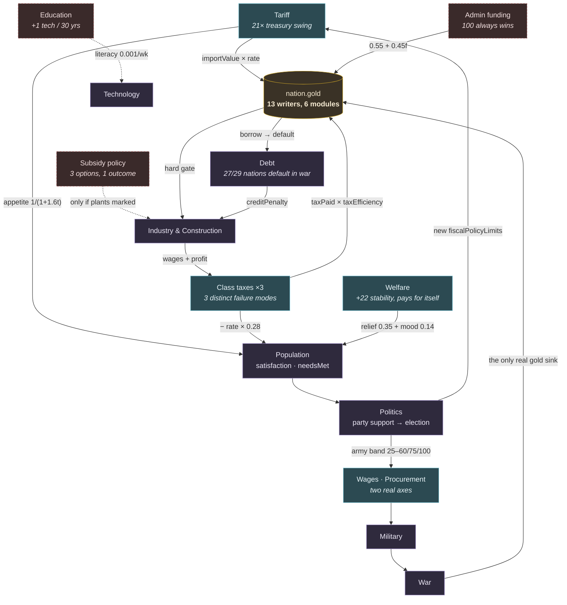

# MECHANIC FINDINGS

Mechanic-by-mechanic X-ray of the current source. One section per mechanic.
Every claim is tied to `file · function() · line range` and, where a claim is
about behaviour, to a measurement that can be reproduced.

**Method.** Static reading of `src/`, plus controlled scenario runs through the
existing audit harness (`scripts/audit/harness.mjs`). Every scenario runs in its
own Node process (module-level id counters make same-process reruns diverge),
uses three seeds (`ix-a`, `ix-b`, `ix-c`), 60 warm-up weeks as AI followed by
260 measured weeks as the player, wars suppressed unless stated, and re-applies
the lever every week. Reported numbers are 3-seed medians. Companion files:
`MECHANIC_ATLAS.html` (interactive), `MECHANIC_MAP.json` (machine-readable).

No game code was modified in producing this document.

---

# BUDGET

## WHAT IT DOES

Budget is the weekly closing of the national treasury (`nation.gold`) and the
nine policy dials the player sets to steer it. It owns almost none of the
numbers it spends — it is a **collection point and a rationing device**, not a
producer.

There are two parallel accounting systems, and this is the single most important
structural fact about the mechanic:

| | `nation.budget` | `nation.economy` |
|---|---|---|
| Built by | `cities.js nationBudget() 381-457` | `economy.js fiscalBalance() 2678-2728` |
| Contains | crown/city/province gold, food, timber, iron; army **wages**; administration cost | class taxes, tariffs, social spending, construction upkeep, debt |
| Applied to `gold` | `turn.js produce() 554-565` → `nation.gold += budget.net.gold` | `economy.js:2727` → `nation.gold += economy.fiscalNet` |
| Player dials in it | `militaryWages`, `adminFunding` (read from `economy`, spent here) | taxes, tariff, social, procurement, subsidies |

`updateLedger() 3522-3615` then re-imports two lines out of the *first* system
(`cityRevenue`, `armyCost`, `administrationCost`) into the *second* system's
ledger so the budget screen can show one combined statement. The combined
statement is arithmetically exact (proved below); the split is invisible to the
player and expensive for a reader of the code.

**Player decisions (9 dials, `economy.js setFiscalPolicy() 1629-1678`)**

| Dial | Field | UI range | Actually reachable |
|---|---|---|---|
| Tax × 3 classes | `economy.taxes.{lower,middle,upper}` | 0–100 | 0–100 |
| Tariff | `economy.tariff` | party band | `-50…25` free trade, else `-15…100` |
| Military wages | `economy.militaryWages` | party band | 25–100, **max 60 under pacifism, 75 anti-military** |
| Military procurement | `economy.militaryProcurement` | party band | same band as wages |
| Administration | `economy.adminFunding` | 30–100 | 30–100 |
| Social × 3 | `economy.social.{education,health,welfare}` | 0–100 | **education floored** by `socialFloorOf() 1738-1754` |
| Subsidy policy | `economy.subsidyPolicy` | manual/strategic/none | all three (but see below) |

**AI decisions.** `adjustFiscalAI() 2853-2907` moves taxes ±5 in a "broke/rich"
band with its own private ceilings (lower 35, middle 42, upper 45 — *lower than
the player's 100*) and drifts the tariff ±2/week toward the ruling party's
doctrine. `adjustWarFiscalAI() 2917-3009` runs war/peace/crisis programmes.
`adjustSocialAI() 2742-2801` raises or cuts one social programme per week by 10.

**Automatic, no decision.** Borrowing, repayment, interest, default and debt
restructuring — all in `settleDebt() 3463-3517`. The budget screen's Take Loan /
Repay Loan buttons are permanently `disabled` (`screens.js:1650-1652`).

**What Budget owns vs. what passes through.** It owns `taxes`, `tariff`,
`social`, `adminFunding`, `militaryWages`, `militaryProcurement`,
`subsidyPolicy`, `nation.debt`, `creditPenalty`. Everything else on the ledger —
`cityRevenue`, `armyCost`, `administrationCost`, `factoryProfit`, `wagesPaid`,
`importCost`, `capitalWithheld`, `treatyCost` — is produced by another system and
merely reported here.

## CODE PATH

| Role | File | Function | Lines | What it does |
|---|---|---|---|---|
| Player sets any dial | `src/ui/screens.js` | `render_budget` / handlers | 1549-1780 / 2600-2700 | sliders emit `data-policy`, handler calls `setFiscalPolicy` |
| Single write door | `src/game/economy.js` | `setFiscalPolicy` | 1629-1678 | clamps and stores; the only sanctioned writer |
| Party band | `src/game/politics.js` | `fiscalPolicyLimits` | 193-204 | tariff and army-spending min/max from ruling party |
| Weekly re-clamp | `src/game/politics.js` | `applyGovernmentLimits` | 206-218 (called 332) | re-clamps tariff + both army dials **every week, player included** |
| Education floor | `src/game/economy.js` | `socialFloorOf` | 1738-1754 | `max(HIGHER_EDUCATION.educationFloor[level], programmeFloorOf)` |
| Core equation | `src/game/economy.js` | `fiscalBalance` | 2678-2728 | class income → tax → `fiscalNet` → `nation.gold` |
| Collection efficiency | `src/game/economy.js` | `taxEfficiency` | 1325-1328 | `0.55 + 0.45 · clamp(adminFunding/100, 0.3, 1)` |
| Social bill | `src/game/economy.js` | `socialSpendingCost` | 1797-1807 | `Σ (pop/10000) · level · rate` + `reformModifiers.socialBurden` |
| Tariff revenue | `src/game/economy.js` | `settleGlobalTrade` | 3279-3422 (3401, 3417-3420) | `importValue × tariff/100`, added to `fiscalNet` **and** to `gold` |
| Debt close | `src/game/economy.js` | `settleDebt` | 3463-3517 | interest, borrow, default, restructure, repay |
| Ledger | `src/game/economy.js` | `updateLedger` | 3522-3615 | 25 line items + the balance-sheet identity |
| City/army budget | `src/game/cities.js` | `nationBudget` | 381-457 | crown gold, army **wages**, administration |
| Admin cost | `src/game/cities.js` | `administrationCost` | 210-215 | `(cities−3)^1.45·0.9 + provinces·0.06 + distance + (pop−250k)/10k·0.06` |
| Applied to treasury | `src/game/turn.js` | `produce` | 554-565 | `nation.gold += budget.net.gold` |
| AI dials | `src/game/economy.js` | `adjustFiscalAI` / `adjustWarFiscalAI` / `adjustSocialAI` | 2853-2907 / 2917-3009 / 2742-2801 | AI's own fiscal policy |
| Delegation gate | `src/game/economy.js` | `runEconomicAI` | 3069-3157 | `budget = !player \|\| delegationActive(nation,'budget')` |

### The weekly treasury identity

In execution order inside one `endTurn()` (`turn.js turnSteps()`):

```
produce()          nation.gold += budget.net.gold          // cities.js:  crown gold − army wages − administration
payTreaties()      nation.gold -= due / += due             // turn.js 570-604: reparations, vassal tribute
runNationEconomy() nation.gold -= retainedCost             // 3912  military stockpiling
                   nation.gold -= consumptionCost          // 3947  army weekly consumption
                   nation.gold -= support                  // 2407  factory subsidies
                   nation.gold += economy.fiscalNet        // 2727  taxes − social − construction upkeep
finishEconomy()    nation.gold -= cost                     // 3264  strategic equipment imports
                   nation.gold += tariffRevenue+settlement // 3420
                   settleDebt()                            // 3467/3479/3488/3509 interest, borrow, default, repay
construction/AI    nation.gold -= price                    // construction.js 503, 556; command.js 1020; companies.js 439
```

Thirteen write sites across six modules. Only one of them (`fiscalBalance`) is
what a reader would call "the budget".

**Verified:** `ledger.net` reproduces the real weekly `Δgold` exactly. Over 12
consecutive weeks the deviation from
`Δgold = ledger.net + borrowed − repaid + defaulted` (invariant **L9**) was
`0.00` every single week. On the hot path, the ledger is trustworthy.

**But L9 is asserted, not enforced.** Nothing in `src/` checks it — the identity
lives only in `ACCOUNTING_INVARIANTS.md` and in `scripts/audit/`, which the game
never runs. And three refund paths credit the treasury without booking a ledger
entry, so they break L9 in any week they fire (four sites, all verified):

| Path | Site | What it does |
|---|---|---|
| `dropInvalidProjects` | `economy.js:2100` | `nation.gold += project.funded` with no accumulator touched. The `private` branch three lines above (`:2097-2099`) routes money correctly to its owner — the asymmetry is inside one `if/else`. |
| `cancelTraining` | `recruitment.js:475` | refunds gold without decrementing `outlayGold`, though the matching spend does go through `pay()` |
| `cancelConstruction` | `construction.js:615-617` | *does* try to correct the ledger, but as `Math.max(0, projectGold − refund)`. `updateLedger():3554` zeroes `projectGold` every week, so a cancel in a week with nothing newly queued leaves `max(0, 0 − refund) = 0` and the refund is unbooked. |
| project conversion | `construction.js:906-909` | `nation.gold += unbuilt share` with no ledger correction at all |

None fired in the measured window, which is why the identity looked perfect.
That is the point: **the invariant holds by luck of the hot path, not by
construction.**

## WHAT ACTUALLY MATTERS

Ranked by measured downstream consequence.

### 1. Tariff — the strongest dial in the game, and a real trade-off

| tariff | revenue | treasury @260wk | imports | needsMet | factory levels | GDP |
|---:|---:|---:|---:|---:|---:|---:|
| −15 (floor) | −29.5 | 2,482 | 38.8 | **0.943** | 32 | 644 |
| 0 | 0 | 13,897 | 29.0 | 0.951 | 40 | 826 |
| 25 | 25.0 | 22,930 | 20.5 | 0.850 | 39 | 785 |
| 50 | 46.5 | 53,022 | 19.4 | 0.750 | 39 | 824 |
| 100 | 45.4 | 52,404 | 12.7 | **0.700** | 40 | 792 |

A **21× treasury swing** — larger than every other dial combined. The mechanism
is real on both sides: `settleGlobalTrade():3319` reduces import appetite by
`1/(1 + tariff/100 × IMPORT_ELASTICITY)` and `:3323` cuts export access by
`1/(1 + tariff/100 × EXPORT_RETALIATION)`. Revenue saturates around 50% —
pushing to 100% buys nothing and costs another 5 points of `needsMet`.

**Correction — protectionism does not protect domestic industry.** The
slider's own note says *"protects domestic industry"*, and the factory-level
column above looks like it agrees. It does not. `settleGlobalTrade():3310`
computes `domestic = min(marketProduction, flow.demand)` **before** the tariff
is consulted, and the tariff only scales the import *bid* and the export
*surplus*. Domestic producers already sell everything they can sell
domestically, and are paid the bare world price either way. There is no path by
which a tariff raises domestic sales or domestic prices.

Read the column again and it confirms this: factory levels are 40 / 39 / 39 / 40
across tariffs 0 → 100 — **flat**. The only outlier is the −15 row (32 levels),
which is the run whose treasury was drained to 2,482 with a weekly net of −11.
That nation stopped building because construction is a hard gold gate, not
because it lacked protection. So the causal chain is
`tariff → treasury → construction budget`, not `tariff → price protection`.

What remains is still a genuine trade-off, and still the mechanic's best
feature: **revenue and the ability to build, against a fed population**
(`needsMet` 0.70 → 0.94, which feeds province growth at `provinces.js:796`),
with a party-dependent reachable band. **Do not touch the mechanism — but the
UI note is wrong, and so are both party tooltips** (`politics.js:25-26` promise
caps of 10% and 50%; `fiscalPolicyLimits():195-198` enforces 25% and 100%).

### 2. Class taxation — asymmetric, with visible class consequences

| case | revenue | treasury | needsMet | stability | population | upper pop | privateCapital |
|---|---:|---:|---:|---:|---:|---:|---:|
| lower 0 | 16.3 | 28,080 | 0.686 | 0.676 | 927,270 | 33,000 | 1200 |
| lower 100 | 145.6 | 92,201 | **0.389** | **0.487** | **843,623** | 33,000 | 1200 |
| middle 100 | 124.1 | 71,711 | 0.644 | 0.567 | 923,235 | 31,000 | 1200 |
| upper 100 | 129.7 | 79,293 | 0.694 | 0.586 | 924,761 | **0** | **679** |

The three sliders produce three different failure modes:

- **Lower**: taxing to 100 costs 9% of the national population and 16 points of
  stability. `needsMet` collapses (0.70 → 0.39) which starves province growth
  (`provinces.js weeklyGrowth 799-802`). Self-limiting.
- **Middle**: −30% middle-class population by demotion; GDP actually *rises*.
- **Upper**: **annihilates the upper class** (35,000 → 0) and halves
  `politics.privateCapital` (1200 → 679). Middle class swells 149k → 183k.

**But the mechanism is shared.** Grepping every class-conditional line in the
budget path, only two constants are middle-specific: the welfare relief rate
(`:2582`, lower 0.35 / middle 0.12 / upper 0) and the AI's tax ceiling
(`:2873`, 35 / 42 / 45). Everything else — income weights, wage split, the
satisfaction formula, promotion and demotion — is one code path parameterised by
a table. The distinct *outcomes* above come from where each class sits in that
table (the upper class is the only one receiving factory profit; the lower class
is the only one large enough for its starvation to move the national total), not
from three mechanics. **Middle is the weakest of the three**: it is the only
class whose share of the tax base *shrinks* as the country industrialises,
because `WAGE_SPLIT` gives it 0.2 of payroll while all factory profit goes to
the upper class.

That said, all three still pay: even the most destructive setting ends with a
*larger* treasury. Because gold has few sinks (see §4), the "punishment" rarely
bites the player.

One asymmetry worth naming: `runPopulationMobility():1089` accumulates
`hardshipWeeks` only for `['middle','upper']`, so it is permanently 0 for the
lower class — while `adjustFiscalAI():2874` reads it for all three as its
"do not tax a suffering class" brake. **The brake is strictly weakest for the
class least able to pay**, which is the reverse of the comment's stated intent.

### 3. Military wages and procurement — two genuinely distinct axes

| case | cost | attack power | defence | supplyIndex | arms stock |
|---|---:|---:|---:|---:|---:|
| wages 25 | 2.25 | 47.9 | 63.1 | 0.228 | 27.4 |
| wages 60 | 5.40 | **59.3** | **78.2** | 0.228 | 27.4 |
| procurement 25 | 5.40 | 59.3 | 78.2 | **0.133** | **23.8** |
| procurement 60 | 5.40 | 59.3 | 78.2 | 0.228 | 27.4 |

The cross-test settles the merge question: `wages=100, proc=25` and
`wages=25, proc=100` produce **completely different** end states. Wages drive
combat power (`battles.js:116` `× (0.55 + funding·0.45)`), organisation recovery
(`turn.js:421`) and training speed (`recruitment.js:364`). Procurement drives
stockpiles, supply index and reinforcement rate (`reinforcement.js:22`). Two
axes, not one. In war (156 weeks, forced): wages 25 → 60 raises army power
45.2 → 59.3 and reduces losses (7,906 → 8,550 soldiers) for ~9 gold/week.

**Keep both.**

### 4. The treasury binds *downward only* — and only in war

| case | treasury | factory levels | GDP | projects |
|---|---:|---:|---:|---:|
| default | 52,404 | 40 | 792 | 6 |
| held at 0 gold every week | 0 | **24** | **597** | 0 |
| started with +100,000 | 152,209 | 40 | 792 | 6 |

Starving a nation costs it 40% of its industry — construction is a hard gate
(`construction.js canQueueConstruction():480`, `investmentBlocker():539`,
`economy.js canPayFactoryCost():1376`). But **giving a nation 100,000 extra gold
changes nothing at all**: identical industry, identical GDP, identical project
count. A peaceful player's treasury grows to 52k–250k with no sink.

War changes this completely. Over a full 50-year campaign with wars enabled
(seed `ix-a`, 29 nations, 2,600 weeks):

- **29/29 nations borrowed** at some point
- **27/29 defaulted**
- 10.46% of all nation-weeks involved borrowing
- 7 nations ended pinned at `creditPenalty = 0.85` with `debtCapacity` at its
  floor of 50 and `gold = 0`

So the debt subsystem is not dead code — it is *war* code. In peace the entire
`debtCapacity`/`debtInterestRate`/`settleDebt`/`creditPenalty` layer never fires.

### 5. Welfare — the best-value dial the AI refuses to use

| welfare | cost | lower satisfaction | stability | GDP | treasury |
|---:|---:|---:|---:|---:|---:|
| 0 | 17.3 | 0.580 | 0.544 | 788 | 56,723 |
| 50 | 38.6 | 0.678 | 0.649 | 776 | 49,999 |
| 100 | 60.1 | **0.807** | **0.760** | **843** | **57,880** |

Welfare at 100 raises stability by 22 points and *ends richer than welfare at 0*.
Two channels: `populationDemand():2583` pays 35% of the poor's basket out of the
treasury, and `:2649` adds `welfare × 0.14` straight to satisfaction. Meanwhile
`adjustWarFiscalAI():2981` cuts welfare in war and the drift test shows AI
nations converge to **welfare 0**. AI nations are leaving the strongest stability
lever on the floor.

## WHAT DOES NOT MATTER

### Education: mathematically large, strategically ~irrelevant

The user's canonical question, answered over a **30-year** horizon (1,560 weeks —
necessary because `LITERACY_APPROACH = 0.001`/week, `economy.js:3796`, means
260 weeks covers only 23% of the gap to target):

| education | literacy | research pts/wk | **technologies completed** | treasury | GDP |
|---:|---:|---:|---:|---:|---:|
| 25 (floor) | 0.195 | 2.00 | **8** (8..8) | 252,432 | 1038 |
| 45 | 0.293 | 2.39 | **8** (8..9) | 253,475 | 1152 |
| 90 | 0.514 | **3.57** | **9** (9..9) | 151,446 | 923 |

Literacy 2.6×. Research points **+79%**. Actual gameplay consequence over three
decades: **one extra technology**, bought with 40% of the treasury and 11% of
GDP. Every other measured outcome is flat or worse at education 90.

This is the textbook case the X-ray was looking for: *mathematically different,
gameplay-meaningfully identical.* The chain
`education → literacyTargetOf():3804 → advanceLiteracy():3811 → researchPointsOf()
(technology.js 337-351) → tech` is real, correctly wired, and too slow and too
weakly geared to change a campaign.

Education's *other* role is genuinely load-bearing and should be preserved: it is
an **entry gate**, not a rate. `construction.js investmentBlocker():531-536`
requires education ≥ 25/40/55/70 to buy the next Higher Education level. That is
a discrete, legible decision. The continuous 0–100 slider behind it is the part
that does nothing.

### Administration funding: a dial with one correct answer

| adminFunding | tax efficiency | tax revenue | admin cost | needsMet | stability | GDP |
|---:|---:|---:|---:|---:|---:|---:|
| 30 | 0.685 | 50.0 | 2.10 | 0.700 | 0.645 | 792 |
| 100 | 1.000 | 73.0 | 7.00 | 0.700 | 0.645 | 792 |

Every non-fiscal outcome is **byte-identical** across the whole range. So the
dial reduces to arithmetic: marginal revenue is `0.45 × grossTax`, marginal cost
is `administrationCost(100%)`. Measured on the sample nation: **16.83 vs 5.00**.

100% is optimal unless gross tax falls below `adminCost/0.45 ≈ 11.1` gold/week,
or population reaches **≈ 2.9 million** (the nation measured had 919,187). The
`cities.js:198-208` comment says this dial was deliberately reworked so it would
stop being "sahte bir seçim" — a fake choice. The rework halved the gap but did
not close it: at realistic nation sizes 100% still wins by 3.4×.

The only game state where the AI picks lower is the crisis branch
(`adjustWarFiscalAI():2998` drifts to 60), which is a cash-flow emergency, not a
strategy.

### Subsidy policy: three options, one outcome

| policy | subsidised plants | subsidy cost | employees | fill | GDP | treasury |
|---|---:|---:|---:|---:|---:|---:|
| manual | 0 | 0 | 70,840 | 0.841 | 792 | 52,404 |
| strategic | 0 | 0 | 70,840 | 0.841 | 792 | 52,404 |
| none | 0 | 0 | 70,840 | 0.841 | 792 | 52,404 |
| *(all plants force-marked)* | 13 | 14.36 | **79,477** | **0.922** | **822** | 51,542 |

The three policy options are **bit-identical in peacetime**. `manual` only acts
on plants the player marked one-by-one on the Factories screen; `strategic`
(`applySubsidyPolicy():1692-1702`) only marks anything while at war; `none`
cancels a set that is already empty.

Subsidies themselves *do* work — the mechanism is at `runFactories():2404-2410`
(the state absorbs the loss and sets `factory.profit = 0`, which stops
`runFactoryEmployment():2193-2197` from laying workers off). Forcing them on buys
+12% employment and +3.8% GDP for 1.6% of the treasury. But the player-facing
*control* is a no-op unless they do exactly the per-factory micromanagement that
`CLAUDE.md` says the delegation layer exists to remove.

**And the subsidy has an undisclosed cost.** `autoUpgradeFactory():1985` is
`if (factory.profit <= 0) return false;` — while `:2409` sets a subsidised
plant's profit to exactly 0. **A subsidised plant can therefore never level up,
for as long as the subsidy is on.** The tooltip promises the state will cover
losses; it does not mention that it also freezes the plant. Nothing in the UI
says so.

### Public health: one real channel, tiny gearing

| health | cost | standard of living | population @260wk | city pop |
|---:|---:|---:|---:|---:|
| 0 | 20.0 | 15.06 | 924,966 | 7 |
| 100 | 53.9 | 17.43 | 931,057 | 7 |

Two consumers, and a grep for `socialLevel(` finds only one of them:

- `economy.js:2660` → `standardOfLiving += level × 2.5` → `cities.js growCities():154-160`
- `provinces.js:790` → `health = 1 + social.health/100 × 0.35` multiplying weekly
  population growth — **read raw, bypassing `socialLevel()`**

+0.66% population over five years for +34 gold/week; zero city growth. Real, but
the weakest gold-to-consequence ratio of any dial.

**And welfare reaches the same endpoint.** Welfare raises `needsMet`
(`:2583` → `:2633`), and `needsMet` is `nourishment` in the *same* province
growth formula (`provinces.js:796`, the `(0.25 + 0.75·nourishment)` term). It
also adds `+2.69` to `standardOfLiving` through satisfaction versus health's
flat `+2.5` — and it costs less per point. The two dials are not cleanly
separated: welfare drives population growth, the effect the UI attributes
exclusively to health. They differ in one honest way — welfare's growth channel
saturates (`nourishment` clamps at 1.0, so a well-fed nation gets nothing more)
while health's ×1.35 multiplier never does. That is a thin distinction for two
sliders.

Note also that `growCities()` runs at turn phase 9, *before* the economy phase,
so both of its gates read last week's `standardOfLiving` and `budget.net.food`.
Moving the health slider does nothing until the following turn.

### Genuinely dead

Each verified by grepping all of `src/`, `scripts/` and `index.html`:

- **`fiscalBalance(nation, baseOutputValue, industrialOutput)` — third parameter
  is dead.** `industrialOutput` appears in the signature (`:2678`) and in a
  comment saying the industry term was removed. It is never read in the body
  (2678-2728) and is still passed at `:3968`.
- **`corruption(cityCount, nation)` — `nation` is dead.** `cities.js:182-185`
  uses only `cityCount`.
- **`CLASS_NEEDS_BUDGET`** (`economy.js:355`) — a three-entry constant with a
  justification comment. Its only other occurrence in the tree is *inside a
  comment* at `:2872`. Zero readers.
- **`socialClass.savingsDrawn`** (`economy.js:2613`) — written for every class
  every week, read by nothing.
- **`ledger.creditPenalty`** — the ledger's copy has no reader.
  (`economy.creditPenalty`, the live field, has many — do not confuse them.)
- **`nation.economy.armySpending`** — written by `setFiscalPolicy`'s legacy
  branch (`:1656-1662`); its only read is the `??=` migration in
  `ensureEconomy():1287-1288`, which cannot fire on a nation that has the two
  modern fields. Dead in live play.
- **`economy.literacyTarget`** (`economy.js:3816`) — written every week for every
  nation, read by nothing. (`literacyTargetOf()`, the function, is very much
  alive; the cached field is not.)
- **`ledger.shareRevenue` / `shareCost` / `dividendRevenue` / `treatyRevenue`** are
  computed and summed but never rendered — those are **hidden, not dead**; see
  gaps below.

### One save/load discontinuity

`city.growth` is the sub-integer accumulator that turns standard-of-living into
city population (`cities.js growCities():159-163`). `save.js:189-190` persists
`pop` and `pops` but **not `growth`**, and the load path (`:353`) never restores
it. Every save/load therefore silently discards up to a full population point of
accumulated growth — at the measured rate, up to several years of health
spending on that city.

### Two comments that the code contradicts

- **`cities.js:430-433`** says army upkeep is now weighted by equipment rather
  than regiment count. `units.js upkeepWeight() 24-26` and
  `units.js regimentCount() 111-113` are **byte-identical**
  (`unit?.regiments?.length ?? 1`). `armyWeight` *is* the regiment count, and
  `nationBudget()` accumulates the same number into two variables.
- **`politics.js:25-26`** tells the player free trade caps the tariff at 10% and
  protectionism reaches 50%. `fiscalPolicyLimits():195-198` enforces **25% and
  100%**.

## CONNECTIONS

### Budget → outward (verified)

| To | Value crossing | Writer | Reader | If it changes |
|---|---|---|---|---|
| Treasury | `economy.fiscalNet` | `fiscalBalance():2726` | `:2727` | every gold gate below moves |
| Trade | `economy.tariff` | `setFiscalPolicy():1636` | `settleGlobalTrade():3319,3323,3401` | import volume, export access, revenue |
| Population | `classes[c].taxPaid` | `fiscalBalance():2708` | `populationDemand():2570` (next week) | household budget, `needsMet` |
| Population | `taxes[c]/100` | player/AI | `populationDemand():2649` | satisfaction `− rate × 0.28` |
| Population | `social.welfare` | player/AI | `:2583` relief, `:2649` mood | basket out-of-pocket, satisfaction |
| Population | `social.health` | player/AI | `provinces.js:790` **raw read** | weekly population growth ×1.35 |
| Politics | `classes[c].satisfaction` | `populationDemand():2648` | `politics.js supportScore()` | party support → election → **new `fiscalPolicyLimits`** |
| Politics | `economy.stability` | `updateStability():2465-2488` | `adjustSocialAI():2770` and elsewhere | AI raise-order, unrest |
| Military | `militaryWages` | `setFiscalPolicy():1640` | `battles.js:116`, `turn.js:421`, `recruitment.js:364`, `cities.js:433` | combat power, org recovery, training, cost |
| Military | `militaryProcurement` | `setFiscalPolicy():1640` | `reinforcement.js:22`, `economy.js:726,3222,3878` | supply, reinforcement, stockpiles |
| Construction | `nation.gold` | everywhere | `canQueueConstruction():480`, `investmentBlocker():539` | **hard gate** on all building |
| Construction | `creditPenalty` | `settleDebt():3492` | `upkeepFactor():269`, `:784` | construction power scaled by `1 − penalty` |
| Technology | `social.education` | player/AI | `literacyTargetOf():3806`, `investmentBlocker():533` | research rate; HE investment gate |
| Cities | `adminFunding` | `setFiscalPolicy():1648` | `cities.js:436` | administration cost |
| Companies | `nation.gold` | — | `companies.js:437,899` | share purchases blocked when short |
| Identity | `creditPenalty`, `social.education` | `settleDebt`, player | `identity.js:41,57` | national identity label |

### Reverse — what feeds Budget

| From | Value | Producer | Consumed at |
|---|---|---|---|
| Provinces/RGO | `baseOutputValue` | `rawProduction():1888` | `fiscalBalance():2691` → `incomePool` |
| Industry | `economy.wagesPaid` | `runFactories():2394` | `:2705` → lower/middle income |
| Industry | `economy.factoryProfit` | `runFactories():2415` | `:2696` → upper income × `PROFIT_TO_CAPITAL` |
| Companies | `economy.capitalWithheld` | `runCompanies()` | `:2701` deducted from upper income |
| Cities/Provinces | `budget.production.gold` | `nationBudget():399-409` | `updateLedger():3524` as `cityRevenue` |
| Trade | `trade.importValue` | `settleGlobalTrade()` | `:3401` → tariff revenue |
| Military | `armyWeight` | `nationBudget():410-424` | `:433` → army wages cost |
| Population | `economy.population` | `reconcilePopulation()` | `socialSpendingCost():1800`, `administrationCost():213` |
| Reforms | `reformModifiers().socialBurden` | `reforms.js:979` | `socialSpendingCost():1806` — **uncuttable** social floor |
| Peace | `treatyCost/treatyRevenue` | `turn.js payTreaties() 570-604` | `updateLedger():3536-3537` |
| Politics | ruling party doctrine | `fiscalPolicyLimits():193-204` | clamps tariff + army dials weekly |

## PLAYER-VISIBLE GAPS

### The three "weekly balance" numbers

The UI reports the weekly balance in three places with three different formulas.
Measured over 12 consecutive weeks against the real `Δgold`:

| Where | Expression | Value | Error |
|---|---|---:|---:|
| Budget screen "Last week's balance" | `ledger.net` (`screens.js:1780`) | 71.88 | **0.00** ✅ |
| Economy screen "Weekly balance" | `economy.fiscalNet` (`screens.js:782`) | 78.76 | +6.88 |
| Economy header **and HUD "weekly gold"** | `budget.net.gold + fiscalNet` (`screens.js:698`, `hud.js:1137`) | 105.46 | **+33.58 (+47%)** |

The budget screen's own footer is exact. The other number — the one always on
screen — overstates the weekly balance by 47% because it omits every one-off and
market purchase: strategic imports, state purchases, military procurement,
subsidies, project funding, debt interest and share purchases.

**And both appear on the budget screen at once.** `resourceLine()` is rendered
on every screen except construction (`screens.js:416`), so the header strip
prints `105.46` while the ledger footer twelve inches below prints `71.88` for
the same week. A fourth variant, `budget.net.gold` alone, appears elsewhere in
the UI.

The fix is already imported and unused: `screens.js:36` imports
`socialSpendingCost` — the exact function that would make the per-programme
split correct — and never calls it.

### `economy.fiscalNet` means two different things depending on when you read it

`fiscalBalance():2726` sets `fiscalNet = taxes − social − construction`.
`settleGlobalTrade():3419` then does `fiscalNet += tariffRevenue + settlement` —
but that runs in `finishEconomy()`, *after* `runEconomicAI()` has already read it
inside `runNationEconomy():3973`.

Measured on the sample nation (tariff 100%):

```
after runNationEconomy   fiscalNet =  7.76   ← what adjustFiscalAI/adjustSocialAI see
after finishEconomy      fiscalNet = 33.76   ← what the ledger and UI see
AI's "weekly"  = 35.76      real "weekly" = 61.76      the AI misses 42% of its income
```

Both AI branches decide "broke" vs "rich" from the pre-tariff figure
(`:2746`, `:2855`). **The more protectionist or export-heavy a nation is, the
poorer its own AI believes it to be** — so it over-taxes and under-spends. Same
expression, two values, no name distinguishing them.

### Ledger lines computed but never rendered

`updateLedger()` fills 25 line items. `dividendRevenue`, `shareCost`,
`shareRevenue`, `borrowed`, `repaid`, `defaulted` and `creditPenalty` are summed
into `income`/`expenses` (or the balance-sheet identity) but have no row on the
budget screen. A player who defaults sees the treasury stop falling and the
interest rate rise, with no line saying why.

`economy.treasuryHistory` (`:3569-3572`) accumulates a rolling 52-week series and
its own comment says "the budget screen graph is drawn from here". No such graph
exists in `src/ui/`.

### The UI re-derives engine formulas by hand

| UI site | Copy | Engine truth | Verdict |
|---|---|---|---|
| `screens.js:1685` | `55 + wages × 0.45` | `battles.js:116` `0.55 + funding × 0.45` | **numerically correct**, but the constant pair is hand-copied into a second file |
| `screens.js:1676` | `max(25, proc) × max(0.4, supply)` | `reinforcement.js:22-25` `BASE × (0.25 + funding × 0.75)` | **misleading**: at proc 25 the UI says "25%" when the real relative rate is 43.75% |
| `census.js:109` | `0.08 + edu/100 × 0.62 × 0.35` | `literacyTargetOf():3806` `0.08 + schooling × 0.62 × (1+HE) + reach` | third copy of the literacy constants |
| `screens.js:1834` | `tariffThen = revenue × (new/old)` | tariff revenue saturates ~50% (measured) | over-projects high-tariff revenue; predicts zero change from any proposal when the current tariff is 0 |
| `screens.js:1828` | `socialScale` capped by `min(1, …)` | ignores `socialFloorOf` | war-budget proposal can silently not apply its education cut |
| `screens.js:1685` (2nd half) | `recovery = 0.6 + 0.4·wages/100` | `turn.js:419-423` `(0.6+0.4·wages)·(0.7+0.3·supply)` | **drops the supply term** — overstates recovery whenever supply is short, which is the normal state (`supplyIndex` measured 0.13–0.25) |
| `screens.js socialShare() 188-194` | splits `ledger.socialCost` by **slider value** share | `socialSpendingCost():1797-1807` weights each programme by its own `rate` (0.34 / 0.30 / 0.46) **and** adds `reformModifiers.socialBurden`, which belongs to no slider | every per-programme ¤ figure on the budget screen is wrong; welfare actually costs 1.35× what education costs at the same slider position |
| `screens.js taxRow() 1571-1586` | shows `socialClass.taxPaid` per class | `taxPaid` is set at `:2708` **before** `taxes *= taxEfficiency(nation)` at `:2716` | the three class boxes are pre-efficiency and do not sum into the "Total income" line beside them — at `adminFunding 30` they overstate the take by 1/0.685 ≈ **1.46×** |

### Delegating "Budget" hands over more than the label says

`delegation.js:16-21` describes the Budget portfolio as *"class taxes, social
spending and the war budget"*. What `runEconomicAI():3078-3092` actually enables
when `budget` is true is `adjustSocialAI` plus `adjustFiscalAI` — and
`adjustFiscalAI():2906` calls `adjustWarFiscalAI()`, which additionally moves:

- `adminFunding` (`:2998`, `:2952` — drifts to 60 in crisis, back to 100 in
  plenty),
- **every factory's `subsidized` flag** (`:2945`, `:2986-2988`, `:3003-3007`) —
  overriding the player's own per-plant marks,
- the **national research programme** (`abandonProgramme` at `:2941`),
- **purchased investment levels** (`dropInvestmentLevel` at `:2969-2971`) —
  i.e. it can sell off Construction Capacity and Higher Education.

The tariff is the mirror-image surprise: it is *rendered* on the Budget screen
but *delegated* by the Trade switch, so a player who holds Budget themselves can
watch the tariff drift ±2 every week (`adjustFiscalAI():2896`) with no
explanation on the screen where the slider lives.

### Classification

| Item | Class | Evidence |
|---|---|---|
| Tax / tariff / social / military sliders + ledger | VISIBLE AND EXPLAINED | `render_budget():1549-1780`, party band note `:1594-1596` |
| Stability breakdown (war strain, occupation, unemployment) | VISIBLE AND EXPLAINED | `hud.js stabilityWhy() 1167-1183` — unusually good |
| Tariff → import appetite / export retaliation | VISIBLE BUT **MIS**-EXPLAINED | slider note (`screens.js:1746`) says "protects domestic industry"; no such mechanism exists (`settleGlobalTrade():3310`). Party tooltips quote the wrong caps too (`politics.js:25-26`) |
| Subsidy → plant can never level up | HIDDEN BUT MEANINGFUL | `:2409` sets profit 0; `autoUpgradeFactory():1985` gates on profit > 0 |
| Per-programme social ¤ figures | VISIBLE AND WRONG | `screens.js socialShare() 188-194` splits by slider value, not by programme rate |
| Per-class tax ¤ figures | VISIBLE AND WRONG | `taxPaid` is pre-`taxEfficiency`; the boxes do not sum to Total income |
| HUD "weekly gold" | VISIBLE NOT EXPLAINED (and wrong by 47%) | `hud.js:1137` |
| Tax rate → satisfaction `− rate × 0.28` | HIDDEN BUT MEANINGFUL | `:2649`; no UI mentions it |
| Upper tax → `privateCapital` → private industry | HIDDEN BUT MEANINGFUL | `:2696`, `politics.js:282` |
| Subsidy → prevents layoffs | HIDDEN BUT MEANINGFUL | `:2405`, `:2193` |
| `creditPenalty` → construction power | HIDDEN BUT MEANINGFUL | `construction.js:269` |
| `warStrain` → **ruling-party support**, up to −45% | HIDDEN BUT MEANINGFUL | `politics.js:238-244` `score *= 1 − min(0.45, strain·0.3 + occupied·0.4)`. The HUD's `stabilityWhy()` shows war exhaustion's effect on *stability* — this is a second, unshown channel straight into elections |
| Reform `socialBurden` with all three sliders at 0 | HIDDEN BUT MEANINGFUL | `socialSpendingCost():1806` still charges it, but `socialShare()` returns 0 for every programme, so the screen shows ¤0 on all three social rows while the treasury pays |
| Tariff raises the state's **own** military import bill | HIDDEN BUT MEANINGFUL | `procureStrategicGoods():3244` `tariffFactor = 1 + tariff/100` |
| `treasuryHistory` | HIDDEN AND LOW VALUE | written weekly, never drawn |
| `fiscalBalance` 3rd parameter | DEAD | never read in 2678-2728 |
| `corruption()` 2nd parameter | DEAD | `cities.js:182-185` |

## SIMPLIFICATION CANDIDATES

Ordered by (code+state removed) ÷ (gameplay lost). Nothing here is a
recommendation to act — this is the shortlist for the review.

| # | Target | Move | Why | Depth lost |
|---|---|---|---|---|
| 1 | `subsidyPolicy` (3 options) | **MERGE → 1 toggle** | manual/strategic/none are bit-identical in peace; only the *marking* matters | none measured |
| 2 | `social.education` 0–100 slider | **DERIVE → discrete tiers** | 25/45/90 differ by 1 tech per 30 years; the meaningful decisions are the 25/40/55/70 investment gates | none measured; keep the gates |
| 3 | `adminFunding` | **AUTOMATE or REMOVE** | 100 dominates unless population ≈ 2.9M; zero non-fiscal effect | none — it's a solved dial |
| 4 | `social.health` | **MERGE into welfare** | one growth multiplier at ×1.35 max; costliest gold-per-consequence | little; welfare already carries satisfaction |
| 5 | `fiscalBalance` 3rd param, `corruption` 2nd param | **REMOVE** | dead arguments | none |
| 6 | `fiscalNet` two-phase meaning | **DERIVE → split the name** | the AI reads a 42%-wrong income figure | none — it's a defect |
| 7 | HUD "weekly gold" | **DERIVE from `ledger.net`** | one expression, one truth, removes a 47% error | none |
| 8 | `treasuryHistory` | **REMOVE or draw it** | written weekly, never read | none if removed |
| 9 | UI formula copies (`screens.js:1676,1685`, `census.js:109`) | **DERIVE from the engine** | three drift risks, one already misleading | none |
| 10 | `nation.budget` / `nation.economy` split | **MERGE (large)** | two accounting systems, 13 gold write sites, six modules | none — but this is the expensive one |

**Not candidates.** Tariff, the three class taxes, military wages, military
procurement, welfare, and the debt/default layer all pay their complexity back in
measured, divergent outcomes.

## DO NOT TOUCH

- **The tariff band and its two elasticities.** `IMPORT_ELASTICITY`,
  `EXPORT_RETALIATION` and the party band are the only place in the budget where
  a genuine strategic dilemma exists (revenue + industry vs. a fed population),
  and the party band means different governments play it differently.
- **Per-class taxation.** The three sliders produce three different failure
  modes (starvation, demotion, class annihilation). That is depth, not
  duplication.
- **The wages / procurement split.** Proven distinct by cross-test; the
  "strong but unsupplied army" state only exists because they are separate.
- **`settleDebt` and `creditPenalty`.** Inert in peace, decisive in war —
  27/29 nations default in a 50-year campaign, and `creditPenalty` has six
  consumers outside `economy.js`.
- **`updateLedger`'s L9 identity.** Exact to 0.00 on the weekly hot path, and
  the only thing making the budget auditable at all. Keep the identity — but it
  is asserted in a markdown file, not enforced in code, and four refund paths
  bypass it (see the Code Path section). It deserves a runtime guard, not a
  rewrite.
- **`hud.js stabilityWhy()`.** A model of how to expose a hidden calculation.

## FINAL BUDGET VERDICT

### Is the mechanic real?

**Yes, with one large qualification.** Every dial is wired to a real consequence
and the accounting closes exactly. But the treasury is a *floor* constraint, not
a ceiling one: starving a nation costs it 40% of its industry, while handing one
an extra 100,000 gold changes literally nothing. In a peaceful game the treasury
climbs to 52k–250k with no sink, and from that point every budget dial is a
preference, not a decision. War restores the pressure — and only war.

### Strongest effect

**Tariff.** A 21× treasury swing, plus a genuine two-sided trade-off — revenue
and the ability to build against `needsMet` 0.70 → 0.94 — with a
party-dependent reachable band. Nothing else in the budget is close. Note the
trade-off is real but the label is not: the tariff does not protect domestic
production (`settleGlobalTrade():3310` fixes domestic sales before the tariff is
read); it protects the *treasury*, which then pays for construction.

### Weakest effect

**Education** — 79% more research points buys exactly **one extra technology in
thirty years**, at 40% of the treasury. **Administration funding** is a close
second: a dial with one correct answer at every realistic nation size.

### Hidden connection a player would not realise

Raising the **tariff also taxes your own army**.
`procureStrategicGoods():3244` prices state equipment imports at
`price × (1 + tariff/100)`. A protectionist wartime government is paying double
for the rifles it imports, and no UI line connects the two.

Two close runners-up, both verified:

- **Subsidising a factory freezes it.** `:2409` sets a subsidised plant's profit
  to exactly 0, and `autoUpgradeFactory():1985` refuses to upgrade any plant
  whose profit is `<= 0`. The tooltip promises the state covers the losses; it
  does not say the plant will never grow again while it does.
- **Taxing the upper class to 100% empties `politics.privateCapital`**
  (1200 → 679) and with it the private sector's ability to build factories the
  player cannot direct.

### Unnecessary complexity

The **`nation.budget` / `nation.economy` split**. Two independent accounting
objects, thirteen `nation.gold` write sites across six modules, and a ledger that
re-imports three lines from one system into the other so the screen can show a
single statement. The player sees one budget. The code has two. Nothing in the
measurements depends on the split.

Behind it: the **`subsidyPolicy` selector** (three options, one outcome) and the
**`adminFunding` slider** (one correct answer).

### Keep

Tariff and its elasticities; three-class taxation; the wages/procurement split;
welfare; the debt/default layer; the L9 ledger identity; `stabilityWhy()`.

### Simplify

The subsidy policy selector → a single toggle. Education's continuous slider →
the discrete investment gates it already gates. `adminFunding` → automate.
`health` → fold into welfare. The three "weekly balance" expressions → one, from
`ledger.net`. The hand-copied UI formulas → derive from the engine.

### Remove

Genuinely dead, safe to delete: `fiscalBalance`'s `industrialOutput` parameter;
`corruption()`'s `nation` parameter; `economy.treasuryHistory` (unless the graph
it was written for is finally drawn).

Note the distinction: these are dead. The unrendered ledger lines
(`dividendRevenue`, `defaulted`, `creditPenalty`…) are **hidden, not dead** — they
are summed into a total the player does see.

### AI context cost

**Score: 4 / 5** — hard for an AI coding agent to reason about correctly.

| Dimension | Count |
|---|---|
| Modules to read for one budget number | 8 (`economy`, `cities`, `turn`, `politics`, `construction`, `technology`, `provinces`, `reforms`) |
| Relevant functions | ~28 |
| Mutable budget state fields | ~40 (`taxes`×3, `social`×3, 4 dials, `ledger`×25, `debt`, `creditPenalty`, accumulators) |
| `nation.gold` write sites | **13, across 6 modules** |
| Duplicated formulas/constants | 4 (combat-power pair, reinforcement, literacy constants ×3, income share ↔ `RGO_CAPITAL_SHARE`) |
| Phase-order dependencies | 4 (`fiscalNet` pre/post-tariff; `populationDemand` reads last week's income; `constructionUpkeep` one week stale; `applyGovernmentLimits` after the economy) |
| Read-then-zeroed accumulators | 8 (`outlayGold`, `procurementGold`, `subsidyGold`, `projectGold`, `dividendGold`, `shareCostGold`, `shareSaleGold`, `importCost`) |

The three traps that will actually catch an agent:

1. **`fiscalNet` is not one number.** Its value depends on which phase you read
   it in, and both meanings are live in the codebase simultaneously.
2. **`nation.gold` has no single owner.** Grepping `fiscalBalance` finds one of
   thirteen writers.
3. **Policy fields are read three different ways** — `socialLevel(nation,'health')`
   in `economy.js`, `nation.economy.social.health` raw in `provinces.js`,
   `economy.social.health` in `screens.js`. A grep for the accessor misses two
   thirds of the consumers. (This is exactly how the `provinces.js` health
   channel was nearly missed in this very audit.)

### Budget in one diagram



---

*Budget analysis complete. Stopping here as instructed — no changes made to game
code, no balance touched, no refactor performed.*
